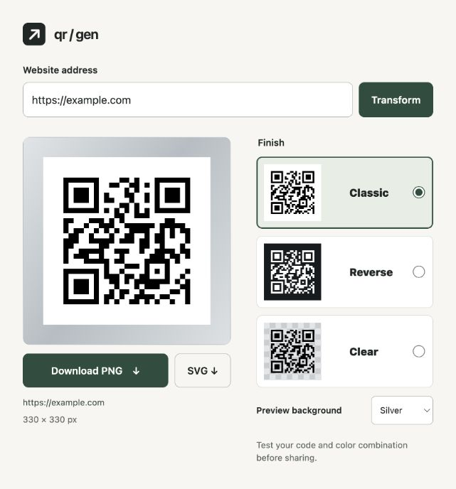

# Make your own QR code

You should be able to make a QR code without creating an account, paying, or
signing up for a sketchy website. That's why I made this.

It runs on your computer and saves a QR image you can use and share. Everything
stays on your computer unless you choose to share it. Hopefully you find it helpful!

## No installation needed

[Download the HTML file](https://github.com/pscripps/qr-gen/releases/latest/download/QR-generator.html)
and open it in your browser. Enter a website address, click **Transform**, and save the QR code as PNG or SVG.
It runs entirely on your computer. No internet connection is required after downloading.

[Download as ZIP](https://github.com/pscripps/qr-gen/releases/latest/download/qr-gen-html.zip) if you prefer; unzip it and open **QR-generator.html**.



## Set up the Python version

This version uses a terminal. You need Python installed; development is tested
with Python 3.12.14. Download this repository using **Code → Download ZIP**, unzip
it, and open a terminal in the extracted folder.

Run these setup commands once:

**macOS or Linux**

```bash
python3 -m venv .venv
source .venv/bin/activate
python -m pip install -r requirements.txt
```

**Windows (Command Prompt)**

```bat
py -m venv .venv
.venv\Scripts\activate.bat
python -m pip install -r requirements.txt
```

Setup needs internet access to download a required library. Generating QR codes
works offline; the generator makes no network requests.

## Make a QR code

Replace the example URL with your own. Keep the quotation marks:

```bash
python qr_gen.py "https://example.com" mycode.png
```

Your image is saved as **mycode.png** in the same folder. Open it like any other
image, then scan it with your phone's camera before sharing or printing it.
You can encode ordinary text instead of a URL, too. Keep the clear border around
the QR code when using the image; don't crop it away.

If you omit the filename, the image is saved as **qrcode.png**. Existing files
are protected. Choose a different filename, or explicitly replace one:

```bash
python qr_gen.py "https://example.com" mycode.png --force
```

For help, run `python qr_gen.py --help`. If your text is empty or too long, the
tool will explain the problem. Your text is preserved exactly, including spaces.

The image directly contains your link or text. There is no subscription,
intermediate redirect, or built-in expiration. A linked website still needs to
remain available. Anyone who has the image can read what it contains.

## Finishes and SVG

The HTML offers Classic, Reverse, and Clear. The Python command also offers Frost:

```bash
python qr_gen.py "https://example.com" mycode.svg --preset clear --format svg
```

Use `classic`, `reverse`, `clear`, or `frost`. PNG is the default format.
Test your code and color combination before sharing.

## Development checks

Use Python **3.12.14**, Node **22.23.1**, and npm **10.9.8** (pinned in the repository). With the environment
above activated:

```bash
python -m pip install pip==26.0.1
python -m pip install -r requirements-dev.txt
git config core.hooksPath .githooks
npm ci --ignore-scripts
npm run build
python tools/check.py
```

The same command runs before commits. It checks code quality and tests that
generated QR images decode correctly. These checks run offline.

Browser source lives in `web/`. Run `npm run build` after editing it to update
`QR-generator.html`, the self-contained download. The check verifies that this
file matches its source. See [verification notes](VERIFICATION.md) for details.
